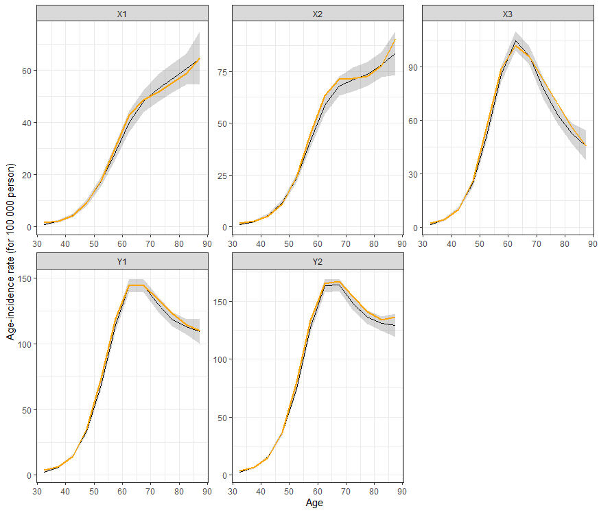
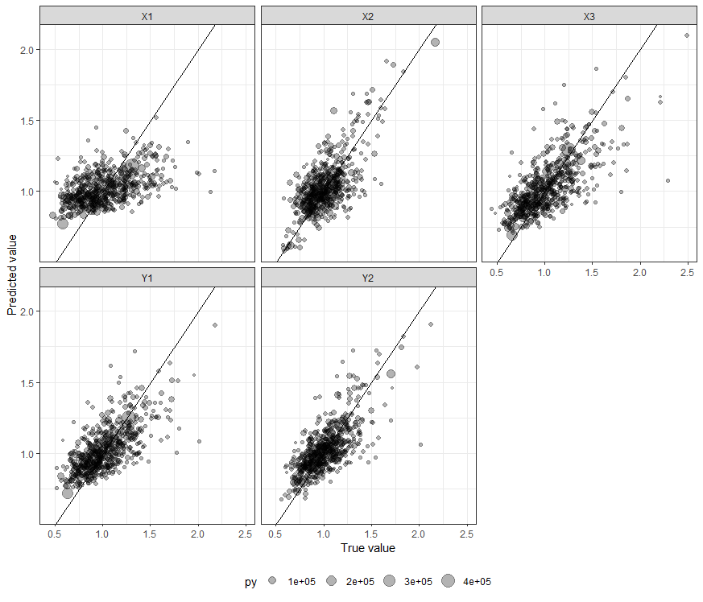
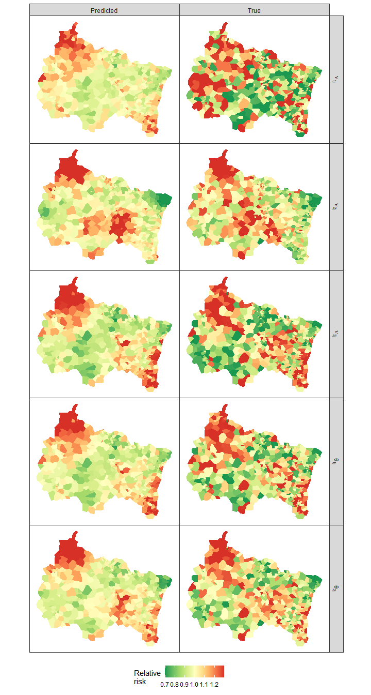

<!-- README.md is generated from README.Rmd. Please edit that file -->

# bpscm

## Overview

This repository contains the code to evaluate shared component models
(SCM) for bivariate count data which share common cases using a
Bivariate-Poisson distribution (BP-SCM). The method is described in the
paper entitled *Joint disease mapping for bivariate count data with
residual correlation due to unobserved common cases* submitted for
publication in Biostatistics.

## Content

The repository contains three folders:

-   **stan** : `stan` code used to fit BP-SCM.
    -   `bp_scm_age.stan` is the main program ;
    -   `join_fun.stan` regroups stan funcions used in
        `bp_scm_age.stan`, including BP likelihood and function for
        spatial analysis from
        <https://github.com/ConnorDonegan/Stan-IAR/> .
-   **R** : `R` utility functions.
    -   `prep_data.R` prepares data for `stan` use;
    -   `post.R` recovers and formats posterior estimates for key BP-SCM
        estimates.
-   **data** : data for demonstration. These data are used and described
    in detail in the simulation section of the paper
    -   `lop.rds` : age-incidence rates for the *X*<sub>*i**j**k*</sub>
        derived using two proxies for lips-oral-pharynx (LOP) cancer
        incidence over the 2013-2019 period.
    -   `py.rds` : person-years for 611 zip-codes in east of France for
        the 2013-2019 period.
    -   `shap_geo.rds` : shapefile for the 611 zip-codes, in `sf`
        format.
    -   `sim_data.R` : `R` code used to generate `data_sim.rds`
    -   `fit.rds` : results of BP-SCM fitted to `data_sim.rds` (see
        hereafter)
    -   `data_sim.rds` : simulated bivariate counts for the 611
        zip-codes, using following parameters

<center>

|                 |   N | *δ*<sub>*i*</sub> | *σ*<sub>*i*</sub> | *ϕ* |
|:----------------|----:|------------------:|------------------:|----:|
| *X*<sub>1</sub> |   5 |              0.15 |              0.25 | 0.5 |
| *X*<sub>2</sub> |   7 |              0.10 |              0.15 | 0.7 |
| *X*<sub>3</sub> |  10 |              0.30 |                   | 0.8 |

</center>

## Illustration

As an illustration of how to use the proposed code, we will fit the
BP-SCM to the simulated data `data_sim.rds`. We begin by loading
packages and programs required for the analysis:

``` r
library(rstan)
library(tidybayes)
library(tidyverse)
library(magrittr)
library(mgcv) 
library(INLA)
library(sf)
source("./R/prep_data.R")
source("./R/post.R")
theme_set(theme_bw())
```

### Prepare data for stan use

The `data_sim.rds` dataset is tabulated by geographical area, proxy (Y1,
Y2, X1, X2, X3) and age (columns `age` gives the median of the 5-years
age class). `py` gives the number of person-years, `Y` the observed
counts, `lbd` the Poisson mean of the counts.

``` r
dt <- readRDS("./data/data_sim.rds")
dt %>%
  filter(geo=="08000", age ==62.5)
#> # A tibble: 5 × 8
#> # Groups:   age, geo, py [1]
#>   geo     age prox      py     Y       lbd        ar     re
#>   <chr> <dbl> <chr>  <dbl> <int> <dbl[1d]> <dbl[1d]>  <dbl>
#> 1 08000  62.5 Y1    12002.    23     22.6   0.00145  -0.182
#> 2 08000  62.5 Y2    12002.    37     33.3   0.00165   4.45 
#> 3 08000  62.5 X1    12002.     8      5.74  0.000429 -0.182
#> 4 08000  62.5 X2    12002.    22     16.4   0.000633  4.45 
#> 5 08000  62.5 X3    12002.    15     16.8   0.00102   1.06
```

`dt` contains the usually unobserved counts for the
*X*<sub>*i**j**k*</sub>. We thus filter out those observations to focus
on bivariate counts (*Y*<sub>1*j**k*</sub>,*Y*<sub>2*j**k*</sub>) to be
fitted in the BP-SCM.

``` r
dt_Y <- dt %>%  filter(str_detect(prox,"Y")) 
```

To prepare the data for `stan` use, we have to define the different
component of the model (i.e., counts, proxy identifier, offsets, the
type of Gaussian Markov Random Field (GMRF) for the random effects
*b*<sub>*i**j*</sub> and *c*<sub>*j*</sub>, spline basis for the age
rates). This is done by specifying a formulae for the model, as follow:

``` r
form <-inc(Y,prox) ~ offset(log(py)) +  s(age,bs="cr",k=5) + 
  s(geo,X1,bs="bym2") +  s(geo,X2,bs="bym2") +  s(geo,X3,bs="bym2")
```

The term `inc(Y,prox)` indicates that the counts are in variable `Y` and
the proxy identifier is `prox`, the term `s(geo,X1,bs="bym")` specifies
the type of GMRF for the proxy *X*<sub>1</sub> (`bym2` here;
alternatives are `iid` or `icar`), and the spline is specified as in the
`mgcv` package.

The formulae is used in `prep_data` function to prepare data needed to
evaluate the `stan` model. The geographical structure of the data is
specified thanks to the `geo` parameter of the function.

Note that the identifier of the geographical areas, in the shape file
and in the data set, must be named `geo`.

``` r
shap_geo <- readRDS("./data/shap_geo.rds")
stan_dt <-  prep_data(dt = dt_Y,
            geo=shap_geo,
            form=form)
```

### Estimate the model

The BP-SCM is then evaluated with usual `rstan` functions:

``` r
bpscm <- stan_model("./stan/bp_scm.stan", model_name = "bpscm")

chains <- 4
iter <- 2000
warmup <- 1000

deb<-Sys.time()
fit = 
  sampling(
    bpscm,
    data = stan_dt,
    chains = chains, cores = chains,
    iter = iter, warmup =warmup,
    pars = c("Int","rho","tau","w","theta","r","mu","nu","lbd","log_lik","sd_c","sd_b","phi","bc"),
    seed = 24,
    open_progress = FALSE,verbose=T
  )
(tps <- difftime(Sys.time(),deb,units = "mins"))
```

The model took about half an hour to run and indicated no pathological
behaviour:

``` r
check_hmc_diagnostics(fit)
#> 
#> Divergences:
#> 0 of 4000 iterations ended with a divergence.
#> 
#> Tree depth:
#> 0 of 4000 iterations saturated the maximum tree depth of 10.
#> 
#> Energy:
#> E-BFMI indicated no pathological behavior.
```

### Posterior

The `get_pars` function retrieves posterior summary of main models
parameters. Parameters have no convergence issue (*R̂* \< 1.01 and
ESS\>400) and estimates are in line with the values used to simulate the
data (although with some variability):

``` r
get_pars(fit,pars = c("sd_c","tau","sd_b","phi","w"))
#> # A tibble: 16 × 10
#>    param prox      pm median      sd     low     up  rhat ess_bulk ess_tail
#>    <chr> <fct>  <dbl>  <dbl>   <dbl>   <dbl>  <dbl> <dbl>    <dbl>    <dbl>
#>  1 phi   X1    0.430  0.394  0.280   0.0183  0.960   1.00    3454.    2945.
#>  2 phi   X2    0.749  0.777  0.174   0.340   0.986   1.00    3563.    3662.
#>  3 phi   X3    0.748  0.763  0.143   0.435   0.976   1.01    3615.    1614.
#>  4 sd_b  X1    0.141  0.143  0.0752  0.00968 0.280   1.00     669.    3707.
#>  5 sd_b  X2    0.252  0.252  0.0393  0.175   0.327   1.00    4039.    3881.
#>  6 sd_c  X1    0.121  0.121  0.0472  0.0279  0.215   1.00    3467.    3763.
#>  7 sd_c  X2    0.0661 0.0608 0.0407  0.00444 0.157   1.00    4122.    3755.
#>  8 sd_c  X3    0.240  0.240  0.0285  0.186   0.296   1.00    4009.    3834.
#>  9 tau   Y1    0.208  0.207  0.0209  0.168   0.250   1.00    4007.    3960.
#> 10 tau   Y2    0.199  0.198  0.0184  0.165   0.237   1.00    3994.    3869.
#> 11 tau   X1    0.199  0.198  0.0540  0.0995  0.309   1.00    2097.    3362.
#> 12 tau   X2    0.264  0.263  0.0369  0.192   0.338   1.00    3950.    3862.
#> 13 tau   X3    0.0586 0.0575 0.0139  0.0347  0.0877  1.00    4009.    3834.
#> 14 tau   X3    0.240  0.240  0.0285  0.186   0.296   1.00    4009.    3834.
#> 15 w     Y1    0.667  0.668  0.00929 0.649   0.685   1.00    4261.    3888.
#> 16 w     Y2    0.591  0.591  0.00861 0.574   0.608   1.00    4262.    3871.
```

The `get_rates` function gives the posterior summary for age-rate
*ρ*<sub>*i**j**k*</sub> and *r*<sub>*i**j**k*</sub>:

``` r
post_rates <- get_rates(fit,stan_dt)
```

The estimated age-rates closely match the true age-rates used to
simulate the data:

``` r
post_rates %>%
  ggplot()+
  aes(age, 10^5 * pm) +
  geom_line() +
  geom_ribbon( aes(ymin = 10^5 * low, ymax = 10^5 * up) ,
               alpha=0.2) +
  geom_line(data = dt %>% group_by(age,prox) %>% slice(1),
            aes(age,10^5 * ar),
            size=1,
            colour = "orange") +
  facet_wrap(~prox, scales="free") +
  ylab("Age-incidence rate (for 100 000 person)") +
  xlab("Age")
```



Last, we may look at the estimated relatives risks *ν*<sub>*i**j*</sub>
and *θ*<sub>*i**j*</sub>. They can be extracted with the `get_rr`
function:

``` r
post_rr <- get_rr(fit,stan_dt)
```

These relatives risks may be compared with the true relatives risks used
to simulate the data:

``` r
post_rr %<>%
  left_join(
      dt %>% 
        as_tibble() %>%
        group_by(geo,prox) %>% 
        summarise(tm=sum(lbd)/sum(py*ar), py = sum(py))
  ) 
#> `summarise()` has grouped output by 'geo'. You can override using the `.groups` argument.
#> Joining with `by = join_by(prox, geo)`

post_rr %>%
  ggplot() +
  aes(tm,pm,size = py) +
  geom_point(alpha=.3) +
  geom_abline(intercept=0, slope = 1) +
  facet_wrap(~prox) +
  theme(legend.position = "bottom") +
  xlab("True value") + 
  ylab("Predicted value")
```



The shrinkage of the predicted risk for *X*<sub>1</sub> (with low number
of cases and low dependence on *c*<sub>*j*</sub>) is important, whereas
the other risks looks well predicted by the model.

This can be seen on maps of the predicted risks:

``` r
lab_risk <- .%>% 
  mutate(prox =case_when(
    prox=="X1" ~"nu['1j']",
    prox=="X2" ~"nu['2j']",
    prox=="X3" ~"nu['3j']",
    prox=="Y1" ~"theta['1j']",
    prox=="Y2" ~"theta['2j']"
    ))

post_rr %>%
  left_join(shap_geo) %>%
  st_as_sf() %>%
  rename(True = tm, Predicted = pm) %>%
  gather(typ,rr, Predicted, True) %>%
  lab_risk %>%
  ggplot( data = ., aes(fill=rr)) +
  geom_sf( colour = NA) +
  scale_fill_gradientn(colours=rev(RColorBrewer::brewer.pal( n = 9, name = "RdYlGn")),
                       na.value = "transparent",
                       limits=c(0.7,1.3),
                       oob = scales::squish)+
  facet_grid(prox~typ, labeller = label_parsed) +
  theme(panel.grid.major = element_blank(),
        panel.grid.minor = element_blank(),
        axis.text.x = element_blank(),
        axis.text.y = element_blank(),
        axis.ticks = element_blank(),
        panel.spacing = unit(0,'lines'))+
  theme( legend.position = "bottom" ) +
  labs(fill="Relative\nrisk")
#> Joining with `by = join_by(geo)`
```


